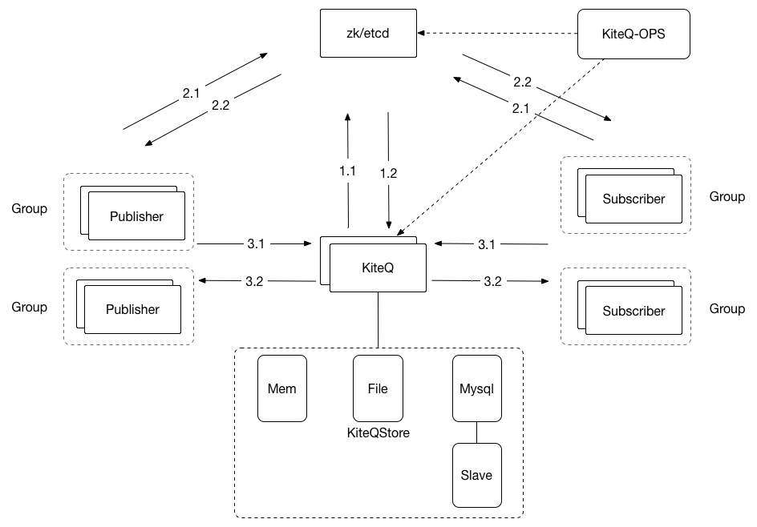

KiteQ 
=======

基于go+protobuff实现的多种持久化方案的mq框架

#### Client For KiteQ
    Go:    https://github.com/blackbeans/kiteq-client-go
    Java : https://github.com/blackbeans/kiteq-client-java
    PHP:   https://github.com/blackbeans/kiteq-client-php
    C++: https://github.com/quguangjie/kiteq-client-cpp

#### 简介
    * 基于zk/etcd维护发送方、订阅方、broker订阅发送关系、支持水平、垂直方面的扩展
    * 基于与topic以及第二级messageType订阅消息
    * 基于mysql、文件存储方式多重持久层消息存储
    * 保证可靠异步投递
    * 支持两阶段提交分布式事务
    * 自定义group内的Topic级别的流控措施，保护订阅方安全
    * kiteserver的流量保护

#### 工程结构
    kiteq/
    ├── README.md
    ├── conf              配置信息
    ├── log               log4go的配置
    ├── build.sh          安装脚本
    ├── doc               文档
    ├── handler           KiteQ所需要的处理Handler
    ├── kiteq.go          KiteQ对外启动入口        
    └── server             KiteQ的Server端组装需要的组件

##### 概念：
    
    * Binding:订阅关系，描述订阅某种消息类型的数据结构
    * Consumer : 消息的消费方
    * Producer : 消息的发送方
    * Topic: 消息的主题比如 Trade则为消息主题，一般可以定义为某种业务类型
    * MessageType: 第二级别的消息类型，比如Trade下存在支付成功的pay-succ-200的消息类型
    
#### Zookeeper数据结构

        KiteServer : /kiteq/server/${topic}/ip:port
        Producer   : /kiteq/pub/${topic}/${groupId}/ip:port
        Consumer   : /kiteq/sub/${topic}/${groupId}-bind/#$data(bind)

##### 订阅方式: 

        Direct (直接订阅)： 明确的Topic+MessageType订阅消息
        Regx(正则式订阅):  Topic级别下，对MessageType进行正则匹配方式订阅消息
        Fanout(广播式订阅): Topic级别下，订阅所有的MessageType的消息

#### 架构图
  
  
  - 流程描述：
    
  KiteQ：
  
        1.1 KiteQ启动会推送本机可以支持的接收和投递的Topic到注册中心(zk/etcd) /kiteq/server节点，同时监听是否订阅本机支持Topic的订阅分组订阅关系变化
    
        1.2 在订阅关系发生变化时，注册中心通过watch机制通知KiteQ更新本地的订阅关系，并可以提供对新增订阅分组的消息投递工作
    
 Producer：
 
        2.1 Producer启动后将本应用需要发送的消息的Topic列表推送到注册中心 /kiteq/pub节点(这部分只是用来集中化管理publish的分组)
    
        2.2 通过配置的消息Topic列表获取注册中心对应KiteQ节点的IP:Port，并增加watch观测KiteQ节点的变化，做本地KiteQ地址列表的变化
    
        3.1 通过获取的IP:Port在本地发起TCP长连接，并保持固定周期的心跳
    
        3.2 KiteQ对长连接验证授权完成后，返回连接建立成功，此后即可发布对应的消息了。
    
 Consumer:
 
        2.1 Consumer启动后会将本分组所订阅的订阅关系Binding推送到注册中心/kiteq/sub节点。
    
        2.2 通过本地订阅关系订阅的Topic列表获取注册中心对应KiteQ节点的IP:Port，并增加watch观测KiteQ节点的变化，做本地KiteQ地址列表的变化
    
        3.1、3.2 与Producer一致，在3.2完成后，KiteQ会在有对应消息来到时，推送给本分组内的随机一台Consumer
   
 KiteQ-OPS:
    
        基于注册中心以及KiteQ暴露的Http接口提供系统的数据，并以图表方式呈现KiteQ当前状态
   
    - 注：
        发布订阅者没有绝对的角色区分。同一个分组既可以作为发布者也可以作为消息的订阅方。

#####  两阶段提交：

    因为引入了异步投递方案，所以在有些场景下需要本地执行某个事务成功的时候，本条消息才可以被订阅方消费。
    例如：
        用户购买会员支付成功成功需要修改本地用户账户Mysql的余额、并且告知会员系统为用户的会员期限延长。
        这个时候就会碰到、必须在保证mysql操作成功的情况下，会员系统才可以接收到会员延期的消息。
    
    对于以上的问题，KiteQ的处理和ali的Notify系统一样，
        1. 发送一个UnCommit的消息到KiteQ ,KiteQ 不会对Uncommite的消息做投递操作
        2. KiteQ定期对UnCommit的消息向Producer发送TxAck的询问
        3. 直到Producer明确告诉Commit或者Rollback该消息
        4. Commit会走正常投递流程、Rollback会对当前消息回滚即删除操作。

#####  QuickStart

    1.编译：sh build.sh 
    2.安装装Zookeeper:省略(或者安装etcd)
    3.启动KiteQ:
    
        toml配置启动
            sh kiteq.sh 
            
            kiteq.sh里面对应的配置：
            ./kiteq -clusterName=集群名称 -configPath=配置文件路径
            文件样例见[conf/cluster.toml]   
         
      - KiteQ的Registry
      
        etcd:  配置 etcd://http://localhost:2379,http://localhost:2379
        zk:    配置 zk://localhost:2181,localhost:2181

##### 启动客户端：
    参考：github.com/blackbeans/kiteq-client-go

#### Donate

#### Contact us 

Mail: blackbeans.zc@gmail.com

QQ: 136448723

QQ Group: 139685004(Kiteq实战群)

